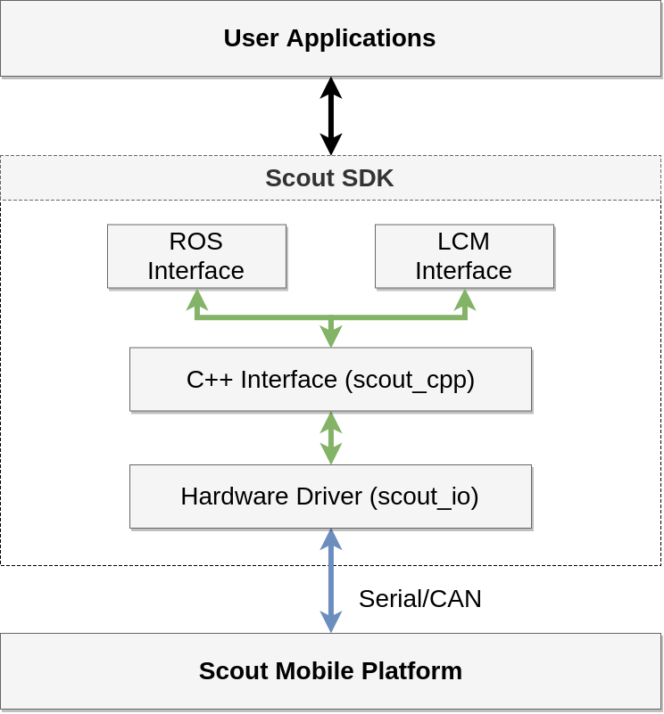

# Introduction



* Data from the chassis:
  * Odometry
* Data to the chassis:
  * Motion command

# Prerequisites

* Make sure your user account has access to
  * serial port (to communicate with robot base)
  * keyboard input (to use keyboard control)

* Grant access to serial port
```
# Note: you can use "ls /dev/ttyUSB*" to check the serial port number on your computer
$ sudo chmod 666 /dev/ttyUSB0
```

* Add user to "input" group
```
$ sudo adduser <your-user-name> input
```

# Build SDK

Install compile tools
```
$ sudo apt install build-essential cmake
```

Configure and build
```
$ cd scout_sdk 
$ mkdir build
$ cd build
$ cmake ..
$ make
```

# Add environment Variables

Add the following lines to your "~/.bashrc"
```
# Scout
export SCOUT_HOME=$HOME/Workspace/agilex/scout_sdk
export PYTHONPATH=$LIBRAV_HOME/src/lcmtypes/python:$SCOUT_HOME/python:$PYTHONPATH
export CLASSPATH=$SCOUT_HOME/build/lcmtypes_librav.jar:$CLASSPATH
```

# Third-Party Components

* serial: https://github.com/wjwwood/serial
* can: TODO